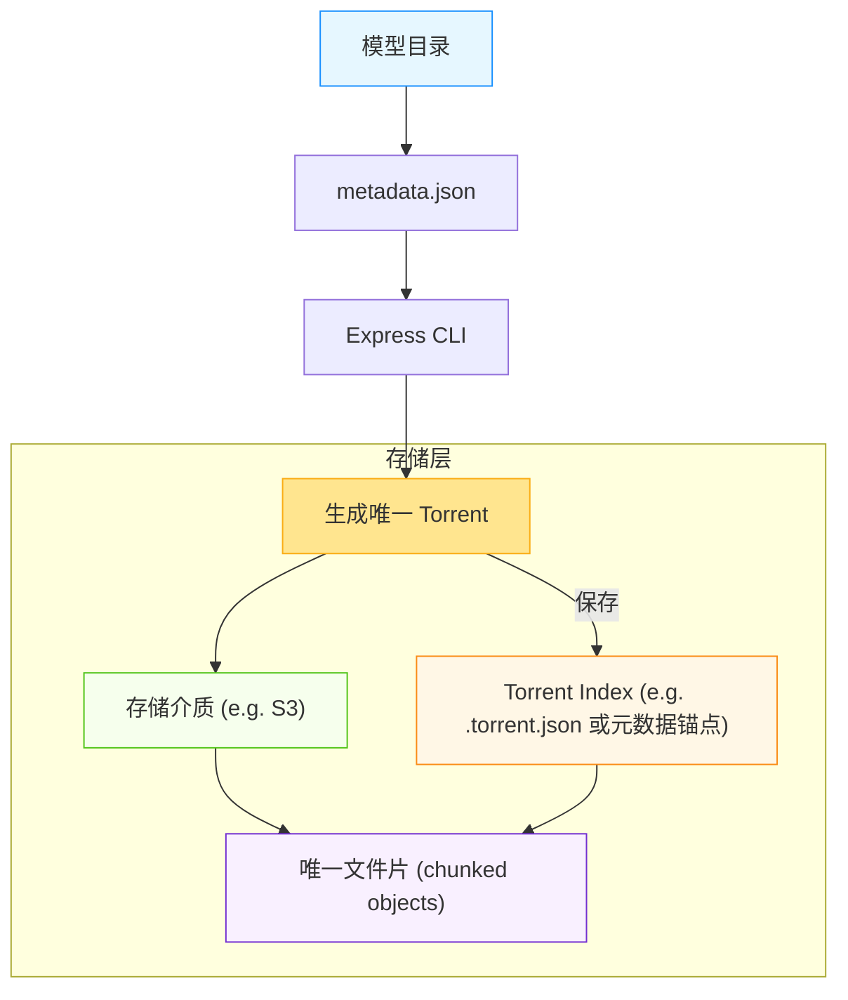

# Express

Express是一个管理模型的工具

## 快速开始

```shell
pip install express --index-url http://pypi.dog.cat/gitlab/dev/+simple/ --trusted-host pypi.dog.cat
```

创建模型(若已有模型可跳过这一步)

```shell
$ express create model_name
Created model model_name
$ ls model_name
index.json  metadata.json
```

上传模型

```shell
$ export S3_AK=XXX
$ export S3_SK=XXX
$ export S3_BUCKET=XXX
$ export S3_ENDPOINT=XXX
$ express push model_name
Uploading: metadata.json       [ 146.0 B]
100.0% |████████████████████████████████████████████████████████████| 146.0 B/146.0 B [142.5 B/s]
Uploading: index.json          [ 338.0 B]
100.0% |████████████████████████████████████████████████████████████| 338.0 B/338.0 B [525.9 B/s]
推送完成，请妥善保存模型torrent: 789cab564a2c2dc9c82f2a56b2524aad48cc2dc8498d8789e828a5e62666e680a4324a7313f31cc0a45e727e2e50aa2cb5a838333f0f2867a00784409192c474a0d268b83140be52ac8e525e626e2a50556e7e4a6a4e3c98530b0056e427b6
```

模型的torrent保存着模型的基础信息，作为存储桶级别的唯一索引

查看模型信息
```shell
$ express info 789cab564a2c2dc9c82f2a56b2524aad48cc2dc8498d8789e828a5e62666e680a4324a7313f31cc0a45e727e2e50aa2cb5a838333f0f2867a00784409192c474a0d268b83140be52ac8e525e626e2a50556e7e4a6a4e3c98530b0056e427b6
{
│   'authors': 'example_authors',
│   'emails': 'human@human.com',
│   'version': '0.0.0',
│   'tags': [
│   │   'example_tag'
│   ],
│   'name': 'model_name'
}
```

下载模型

```shell
$ express pull 789cab564a2c2dc9c82f2a56b2524aad48cc2dc8498d8789e828a5e62666e680a4324a7313f31cc0a45e727e2e50aa2cb5a838333f0f2867a00784409192c474a0d268b83140be52ac8e525e626e2a50556e7e4a6a4e3c98530b0056e427b6
Downloading: model_name/index.json 338.0 B [295.0 B/s]
✓ Skip model_name/metadata.json: already exists
```

## 存储模式

