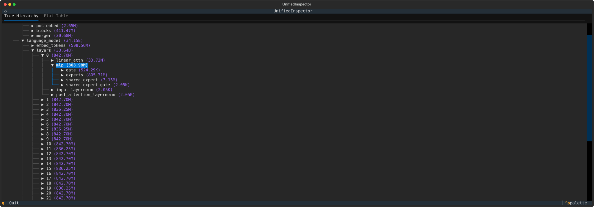
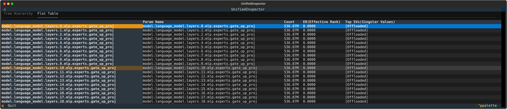

# 项目介绍

express是一个基于终端的可视化分析、分发、管理transformers的工具，支持于私有的模型管理

## 快速开始

在开始前请保证您的设备上有足够的显存在GPU上加载模型

```shell
uv pip install .
```

### 预览模型的信息

```shell
express view <your_model_path>
```




或预览时计算逐Tensor的有效秩与奇异值分布图等信息
```shell
express view <your_model_path>
```

进行模型逐矩阵的计算
支持Tensor与Tensor、Tensor与标量的计算，并支持乘法交换律

> EG: 两个模型的加权平均合并
```shell
express compute A=/models/Qwen3.5-35B-A3B-rl-1 B=/model/Qwen3.5-35B-A3B-rl-2 "(1.2*A+0.8*B)/2"
```
### 模型分发与管理

请先在环境变量中配置存储桶介质的信息

```shell
export S3_AK=
export S3_SK=
export S3_BUCKET=
export S3_ENDPOINT=
export LOCAL_WORKDIR=<不设置的默认值为/models>

```

推送与拉取

```shell
$ express push model_name
Uploading: metadata.json       [ 146.0 B]
100.0% |████████████████████████████████████████████████████████████| 146.0 B/146.0 B [142.5 B/s]
Uploading: index.json          [ 338.0 B]
100.0% |████████████████████████████████████████████████████████████| 338.0 B/338.0 B [525.9 B/s]
推送完成，请妥善保存模型torrent: 789cab564a2c2dc9c82f2a56b2524aad48cc2dc8498d8789e828a5e62666e680a4324a7313f31cc0a45e727e2e50aa2cb5a838333f0f2867a00784409192c474a0d268b83140be52ac8e525e626e2a50556e7e4a6a4e3c98530b0056e427b6
```

> torrent是模型的唯一索引，是模型的基础信息编码的来

```shell
express pull <your_torrent>
```

模型的torrent保存着模型的基础信息，作为存储桶级别的唯一索引

查看模型信息
```shell
$ express info <torrent>
{
│   'authors': 'example_authors',
│   'emails': 'human@human.com',
│   'version': '0.0.0',
│   'tags': [
│   │   'example_tag'
│   ],
│   'name': 'model_name'
}
```

下载模型

```shell
$ express pull <torrent>
Downloading: model_name/index.json 338.0 B [295.0 B/s]
✓ Skip model_name/metadata.json: already exists
```