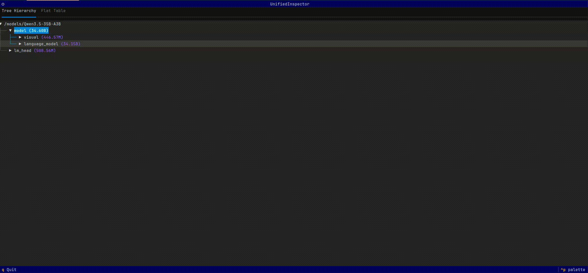
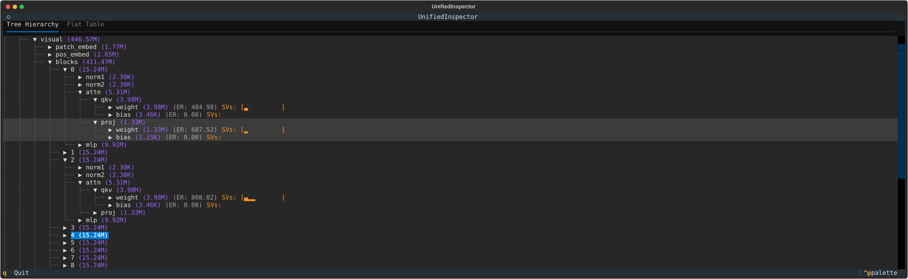

# Express: Visual Analysis & Distribution Toolkit for Transformers

`express` is a terminal-based toolkit designed for visual analysis, algebraic computation, and private distribution of Transformer models.

## Key Features
- **Visual Analytics**: Analyze per-tensor metrics including Effective Rank and Singular Value Distribution.
- **Model Arithmetic**: Perform tensor-level calculations (e.g., weighted merging) supporting commutative laws.
- **Secure Distribution**: Manage models via S3-compatible storage using unique **Torrent** indexing.

---

## Getting Started

### Installation
Install quickly using `uv`:
```shell
uv pip install .
```

### Configuration
Set up your S3 credentials in environment variables:
```shell
export S3_AK="your_access_key"
export S3_SK="your_secret_key"
export S3_BUCKET="your_bucket_name"
export S3_ENDPOINT="your_endpoint"
export LOCAL_WORKDIR="/models" # Optional
```

---

## Usage

### 1. Deep Model Inspection (View)
*Ensure your GPU has enough VRAM before running.*



- **Standard View**: Basic structure and metadata.
- **Advanced Diagnostics**: Calculate mathematical distributions.
```shell
express view <your_model_path>
```


  With Effective Rank:
```shell
express view <your_model_path> --er --fp
```



### 2. Model Tensor Operations (Compute)
Perform flexible matrix arithmetic across different models. Ideal for experimental model merging.

**Example: Weighted Average Merge**
```shell
express compute A=/path/to/model_1 B=/path/to/model_2 "(1.2*A+0.8*B)/2"
```

### 3. Distribution & Version Control (Push/Pull)

`express` uses a **Torrent** — a unique hash generated from model metadata — as a universal index.

- **Push**: Upload to storage and generate a Torrent hash.
  ```shell
  express push <model_name>
  ```
- **Info**: Inspect remote model metadata via Torrent.

```shell
  express info <torrent>
  ```
- **Pull**: Sync a model to your local workspace.
  ```shell
  express pull <torrent>
  ```